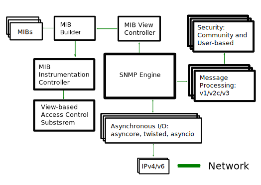

.. toctree::
   :maxdepth: 2

PySNMP architecture
===================

We can look at PySNMP's internal structure from the view point of
SNMP protocol evolution. SNMP was evolving for many years from
a relatively simple way to structure and retrieve data (SNMPv1/v2c)
all the way to extensible and modularized framework that supports
strong crypto out-of-the-box (SNMPv3).

In the order from most ancient SNMP services to the most current ones,
what follows are different layers of PySNMP APIs:

* The most basic and low-level is SNMPv1/v2c protocol scope. Here
  programmer is supposed to build/parse SNMP messages and their payload --
  Protocol Data Unit (PDU), handle protocol-level errors, transport issues and
  so on. Although considered rather complex to deal with, this API probably
  gives best performance, memory footprint and flexibility, unless MIB access
  and/or SNMPv3 support is needed.

* SNMPv3 standards come with abstract service interfaces to SNMP engines
  and its components. PySNMP implementation adopts this abstract API
  to a great extent, so it can be used directly. As additional benefit,
  SNMP RFCs could be referred to API semantics when programming
  PySNMP at this level. User could implements his own SNMP application
  using this API.

* SNMPv3 (:RFC:`3413`) introduced a concept of core "SNMP Applications".
  PySNMP implements them all (in *pysnmp.entity.rfc3413*), so user can
  base his application right on top of one (or multiple) of those
  SNMP core applications.

* Finally, to make SNMP more simple for, at least, most frequent tasks,
  PySNMP comes with a high-level API to core SNMP applications and some
  of SNMP engine services. This API is known under the name *pysnmp.hlapi*
  and should be used whenever possible.

Another view to PySNMP internals could be from the code standpoint:
PySNMP consists of a handful of large, self-contained components
with well-defined interfaces. The following figure explains PySNMP
functional structure.

PySNMP inner components:

* SNMP Engine is a central, umbrella object that controls the other
  components of the SNMP system. Typical user application has a single
  instance of SNMP Engine class possibly shared by many SNMP
  Applications of all kinds.  As the other linked-in components tend
  to buildup various configuration and housekeeping information in
  runtime, SNMP Engine object appears to be expensive to configure to
  a usable state.

* Transport subsystem is used for sending SNMP messages to and
  accepting them from network. The I/O subsystem consists of an
  abstract Dispatcher and one or more abstract Transport classes.
  Concrete Dispatcher implementation is I/O method-specific, consider
  BSD sockets for example. Concrete Transport classes are transport
  domain-specific.  SNMP frequently uses UDP Transport but others are
  also possible.  Transport Dispatcher interfaces are mostly used by
  Message And PDU Dispatcher. However, when using the
  SNMPv1/v2c-native API (the lowest-level one), these interfaces would
  be invoked directly.

* Message and PDU Dispatcher is the locus of SNMP message processing
  activities. Its main responsibilities include dispatching PDUs from
  SNMP Applications through various subsystems all the way down to
  Transport Dispatcher, and passing SNMP messages coming from network
  up to SNMP Applications. It maintains logical connection with
  Management Instrumentation Controller which carries out operations
  on Managed Objects, here for the purpose of LCD access.

* Message Processing Modules handle message-level protocol operations
  for present and possibly future versions of SNMP protocol. Most
  importantly, these include message parsing/building and possibly
  invoking security services whenever required.

* Message Security Modules perform message authentication and/or
  encryption.  As of this writing, User-Based (for v3) and Community
  (for v1/2c) modules are implemented in PySNMP. All Security Modules
  share standard API used by Message Processing subsystem.

* Access Control subsystem uses LCD information to authorize remote
  access to Managed Objects. This is used when running in agent role.

* A collection of MIB modules and objects that are used by SNMP engine
  for keeping its configuration and operational statistics. They are
  collectively called Local Configuration Datastore (LCD).

In most cases user is expected to only deal with the high-level API to
all these PySNMP components. However implementing SNMP Agents, Proxies
and some non-trivial features of managers require using the Standard
Applications API. In those cases general understanding of SNMP
operations and SNMP Engine components would be helpful.

