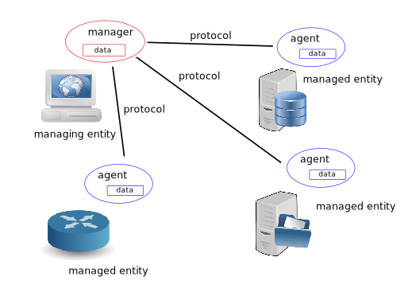
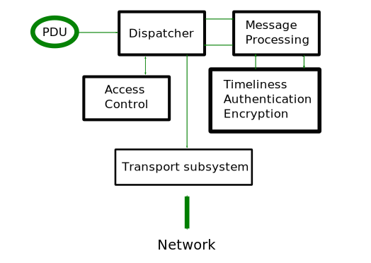
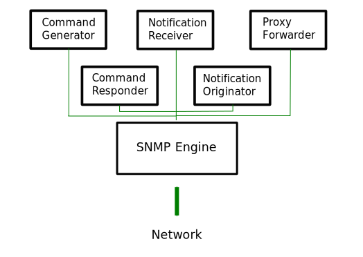

.. toctree::
   :maxdepth: 2

SNMP design
===========

Contrary to what the name might suggest, SNMP is much more than just
a protocol for moving management data. Over time it has grown to be
more complex than its initial designers probably planned it.

Terminology and entities
------------------------

The network management field has its own specific terminology for
various components of a network management architecture, and so we
adopt that terminology here. The peculiarity of this terminology is
that the word "management" is greatly overused. So bare with it.

There are three principle components of a network management
architecture: a managing entity, the managed entity, and a network
management protocol.

* The managing entity is an application running in a centralized
  network management station (NMS).  It is the managing entity 
  that controls the collection, processing, analysis, and/or display
  of network management information.  It is here that actions are
  initiated to control network behavior and here that the human network
  administrator interacts with the network devices.

* A managed entity is typically hardware or software application that
  resides on a managed network. It enumerates and formalizes some
  of its properties and states, important for healthy operation, thus
  making them available to the managing entity. For example, a managed
  entity could be a host, router, switch, printer, or any other device.

* The third piece of a network management system is the network
  management protocol. The protocol runs between the managing entity
  and the managed entity, allowing the managing entity to query the
  status of managed entity and make the latter carrying out actions
  via its agents.

Structure and components
------------------------

SNMP consists of four parts:

* Definitions of network management objects known as MIB objects. 
  Management information is represented as a collection of managed
  objects that together form a virtual information store, known as 
  the Management Information Base (MIB). A MIB object might be a counter,
  descriptive information such as software version; status
  information such as whether or not a device is healthy, or
  protocol-specific information such as a routing path to a destination.
  MIB objects thus define the management information maintained by a
  managed node. Related MIB objects are gathered into so-called MIB modules.

* Data definition language, called SMI (Structure of Management
  Information) that introduces base data types, allows for creating
  their subtypes and more complex data structures. MIB objects are
  expressed in this data definition language. 

* Protocol (SNMP) for conveying information and commands between a managing
  and managed entities. SNMP is designed around a client-server model.
  What's interesting that both managing and managed entities contain client
  and server components.
      
* Extensible security framework and system administration capabilities.

The latter features were completely absent in SNMP versions prior to
SNMPv3.

Data types
----------

SMI introduces eleven base data types used for representing managed
objects states. They are either pure ASN.1 types or their
specializations. Pure ASN.1 types:

* INTEGER
* OCTET STRING
* OBJECT IDENTIFIER

ASN.1 is a really aged and quite complex set of standards that deals
with structuring and serializing data in a portable way.

SNMP-specific subtypes of those base ASN.1 types are:

* Integer32/Unsigned32 - 32-bit integer
* Counter32/Counter64 - ever increasing number
* Gauge32 - positive, non-wrapping 31-bit integer
* TimeTicks - time since some event
* IPaddress - IPv4 address
* Opaque - uninterpreted ASN.1 string

In addition to these scalar types, SNMP defines a way to collect them
into ordered arrays. From these arrays 2-d tables could be built.

PySNMP relies on the `PyASN1 <http://pyasn1.sf.net/>`_ package for
modeling all SNMP types.  With PyASN1, instances of ASN.1 types are
represented by Python objects that look like either a string or an
integer. 

We can convert PyASN1 objects into Python types and back. PyASN1
objects can participate in basic arithmetic operations (numbers)
or in operations with strings (concatenation, subscription etc).
All SNMP base types are immutable like their Python counterparts.

.. code-block:: python

    >>> from pyasn1.type.univ import *
    >>> Integer(21) * 2
    Integer(42)
    >>> Integer(-1) + Integer(1)
    Integer(0)
    >>> int(Integer(42))
    42
    >>> OctetString('Hello') + ', ' +
    >>> OctetString(hexValue='5079534e4d5021')
    OctetString('Hello, PySNMP!')

Users of PySNMP library may encounter PyASN1 classes and objects
when passing data to or receiving data from PySNMP.

The one data type we will discuss in more detail shortly is the OBJECT
IDENTIFIER data type, which is used to name an object.  With this
system, objects are identified in a hierarchical manner. 

Object Identifier
+++++++++++++++++

OIDs are widly used in computing for identifying objects. This system
can be depicted as a tree whose nodes are assigned by different
organizations, knowledge domains, types of concepts or objects,
concrete instances of objects. From human perspective, an OID is a
long sequence of numbers, coding the nodes, separated by dots.

Each 'branch' of this tree has a number and a name, and the complete
path from the top of the tree down to the point of interest forms the
name of that point. This complete path is the OID, the "identifier of
an object" respectively. Nodes near the top of the tree are of an
extremely general nature.

Top level MIB object IDs (OIDs) belong to different standard
organizations. Vendors define private branches including managed
objects for their own products.

At the top of the hierarchy are the International Organization for
Standardization (ISO)  and the Telecommunication Standardization
Sector of the International Telecommunication Union (ITU-T), the two
main standards organizations dealing with ASN.1, as well as a brach
for joint efforts by these two organizations.

In PyASN1 model, OID looks like an immutable sequence of numbers.
Like it is with Python tuples, PyASN1 OID objects can be concatinated
or split apart. Subscription operation returns a numeric sub-OID.

.. code-block:: python

    >>> from pyasn1.type.univ import *
    >>> internetId = ObjectIdentifier((1, 3, 6, 1))
    >>> internetId
    ObjectIdentifier('1.3.6.1')
    >>> internetId[2]
    6
    >>> [ x for x in internetId ]
    [1, 3, 6, 1]
    >>> internetId + (2,)
    ObjectIdentifier('1.3.6.1.2')
    >>> internetId[1:3]
    ObjectIdentifier('3.6')
    >>> internetId[1]
    >>> = 2
    ...
    TypeError: object does not support item assignment

Collections of objects
----------------------

Management Information Base (MIB) can be thought of as a formal
description of a collection of relevant managed objects whose values
collectively reflect the current "state" of some subsystem at a
managed entity. These values may be queried, modified by or reported
to a managing entity by sending SNMP messages to the agent that is
executing in a managed node.

For example, the typical objects to monitor on a printer are the
different cartridge states and maybe the number of printed files, and
on a switch the typical objects of interest are the incoming and
outgoing traffic as well as the rate of package loss or the number of
packets addressed to a broadcast address.

Every managed device keeps a database of values for each of the
definitions written in the MIB. So, the available data is actually not
dependent on the database, but on the implementation.  It is important
to realize that MIB files never contain data, they are functionally
similar to database schemas rather than data stores.

To organize MIB modules and objects properly, all the manageable
features of all products (from each vendor) are arranged in this MIB
tree structure.  Each MIB module and object is uniquely identified
by an Object Identifier.

Both SNMP managed and managing entities could consume MIB information.

* Managing entity

  + Looks up OID by MIB object name
  + Casts value to proper type of MIB object
  + Humans read comments left by other humans

* Managed entity

  + Implements MIB objects in code

From human perspective, MIB is a text file written in a subset of
ASN.1 language. We maintain `a collection
<http://mibs.snmplabs.com/asn1/>`_ of 9000+ MIB modules that you can
use for your projects.

PySNMP converts ASN.1 MIB files into Python modules, then SNMP
engine loads those modules at runtime on demand. PySNMP MIB modules
are universal -- the same module can be consumed by both managed and
managing entities.

MIB convertion is performed automatically by PySNMP, but technically,
it is handled by PySNMP sister project called
`PySMI <http://pysmi.sf.net>`_. However you can also perform said
conversion by hand with PySMI's *mibdump.py* tool.

Protocol operations
-------------------

SNMP is designed around a client-server model. Both managing and
managed entities contain client and server components.  Clients and
servers exchange data in a name-value form.  Values are strongly
typed.

Central to protocol entity is *SNMP engine* that coordinates workings
of all SNMP components.

Two modes of protocol operation are defined:

* Request-response messages
* Unsolicited messages

Protocol carries SNMP messages. Besides header information used for
protocol operations, management information is transferred in
so-called Protocol Data Units (PDU). Seven PDU types are defined in
SNMP addressing conceptually different operations to be performed by
either managing or managed entities (Manager or Agent repectively).

* Manager-to-agent

  + GetRequest, SetRequest, GetNextRequest, GetBulkRequest,
    InformRequest

* Manager-to-manager

  + InformRequest, Response

* Agent-to-manager

  + SNMPv2-Trap, Response

Core applications
-----------------

The standard (:RFC:`3413`) identifies a few "standard" SNMP applications
that are associated with either managing or managed entities.

PySNMP implements all these standard applications (via *Native SNMP
API*) carefully following RFCs and their abstract service
interfaces. The backside of this approach is that it's way too
detailed and verbose for most SNMP tasks. To make SNMP easy to use,
PySNMP introduces *High-level SNMP API*.

